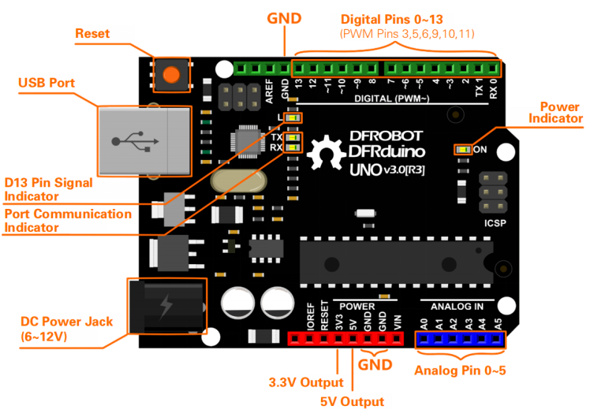
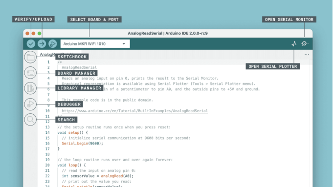

### Arduino Basic Workshop  

#### by Dr. [Aven Le ZHOU](https://aven.cc), 2025/26 S1

---

## What is Arduino?  
- open-source electronics prototyping platform  
- **microcontroller boards** + **software (IDE)**  
- interactive art, design, robotics, IoT, .etc  

----

#### Arduino UNO



----

## Arduino Boards  
- **Uno** – beginner-friendly, most common  
- **Nano** – compact, breadboard-friendly  
- **Mega** – more pins & memory  
- **Leonardo** – USB keyboard/mouse emulation  
- **ESP32** – WiFi/Bluetooth support  

----

#### [Arduino Boards Guides](https://www.dfrobot.com/blog-1540.html?srsltid=AfmBOooyno3QZObH8bNBupJTIXjaNhtBHoUY2MiDHn-fN6cUP0jIdwuo)


----

## Arduino IDE  
- Free software to write & upload code  
- Main parts:  
  - **Editor** → write sketches  
  - **Verify** → check errors  
  - **Upload** → send to board  
  <!-- - **Serial Monitor** → read sensor data   -->

----

### Verify → Upload


----

## Arduino Code Basics  

```cpp
void setup() {
  // runs once
}
void loop() {
  // runs continuously
}
```

**setup()** → initialization
**loop()** → runs forever


---

### Exercises Overview  

1. **Blink LED**  
   - Part A: Onboard LED / Part B: [External LED](https://mc.dfrobot.com.cn/thread-1042-1-1.html)

2. **Fading LED**  
   - [Breathing effect](https://learn.dfrobot.com/makelog-314842.html) + experiment with speed  

3. **Student Exploration**  
   - [Hand Control Light](https://mc.dfrobot.com.cn/thread-321466-1-1.html?fromuid=864588)  or [Morse Code Light](https://learn.dfrobot.com/makelog-314840.html)  

---

## Exercise 1: Blink LED ✨  

----

### Part A – Onboard LED  
- Open: **File → Examples → Basics → Blink**  
- Upload → onboard LED (pin 13) blinks  
-  `delay()` values  → (100, 500, 1000 ms)  
- Reference: [DFRobot – Getting Started](https://learn.dfrobot.com/makelog-314826.html)  

----

### Part B – External LED
- Components: 
  - LED + 220 Ω resistor + breadboard  
- Wiring:  
  - LED anode (+) → **digital pin 8** (+ resistor)  
  - LED cathode (–) → **GND**  
- Modify code:  

```cpp
int led = 8;
```

---

## Exercise 2: Fading LED

----

### Overview  
- Goal: make LED “breathe”  
- Uses **PWM** (Pulse Width Modulation)  
- Connect LED + resistor to **pin 10 (~)**  
- Reference: [DFRobot – Fading Light](https://learn.dfrobot.com/makelog-314842.html)  

----

```cpp
// core idea inside fade functions
analogWrite(ledPin, value);
delay(time / (255 / increment));
```

---

## Exercise 3: Student Exploration 🎯  

----

### Option A – Hand Control Light  
- Use sensor to detect hand motion and control LED  
- Try toggling or modulating brightness based on gesture  
- Tutorial: [DFRobot Forum – Hand Control Light](https://mc.dfrobot.com.cn/thread-321466-1-1.html?fromuid=864588)  

----

### Option B – Morse Code Light  
- Make LED blink SOS (... --- …)  
- Learn **loops**, **timing**, and **pattern sequencing**  
- Tutorial: [DFRobot – SOS Beacon](https://learn.dfrobot.com/makelog-314840.html)  

---

## Assignment Task 📥  

- Upload **3 × video documentations**  
    - casual filming is fine...
- Add a **brief reflective description** 
    - 50–150 words each, try not use AI to generate ...
- Submit via **Learning Mall** as assignment task  